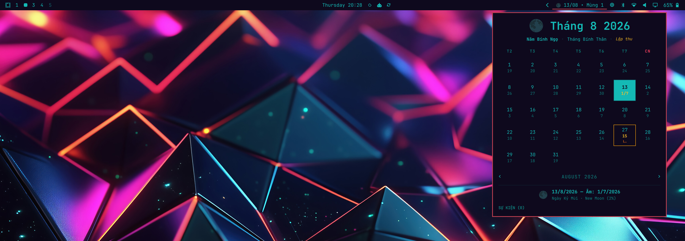

# Omarchy Lunar Calendar Plugin

A feature-rich **Lunar Calendar Plugin** for **Omarchy Quattro** (the Quickshell desktop environment on Arch Linux / Omarchy).

Inspired by `archlatam/omarchy-calendar-activity`, this plugin brings East Asian Lunar Calendar (Lịch Âm / 农历), Moon Phase indicators, Can Chi (Stem-Branch) cycles, 24 Solar Terms (Tiết khí), and Activity/Event tracking straight to your Omarchy desktop bar.



## Features

- **Bar Widget**: Displays Gregorian date, Lunar date (e.g. `13/08 • Mùng 1` or `15/07 Rằm`), and current Moon Phase icon (`🌑` `🌒` `🌓` `🌔` `🌕` `🌖` `🌗` `🌘`) in your top bar.
- **Interactive Calendar Panel**: Pop-up calendar grid showing dual Gregorian + Lunar dates.
- **High-Precision Astronomical Converter**:
  - Converts Solar dates to Lunar dates (Vietnam UTC+7, China UTC+8, or custom timezone).
  - Highlights Mùng 1 (New Moon) and Rằm (Full Moon).
  - Displays Can Chi Year, Month, Day (e.g. *Bính Ngọ*, *Bính Thân*, *Kỷ Mùi*).
  - Displays 24 Solar Terms (*Lập xuân*, *Hạ chí*, *Thu phân*, *Đông chí*, etc.).
  - Calculates exact Moon illumination percentage and age.
- **Activity & Event Manager**:
  - Add activities tied to Gregorian dates or recurring Lunar dates (e.g. Tết, Rằm Tháng Tám, Vu Lan).
  - Highlighting for upcoming traditional holidays and user events.
- **Omarchy Theme Integration**: Respects system fonts and color scheme.

## Installation & Setup

### Interactive Installer (Recommended)

Run the interactive installer script which prompts you for your preferred bar location:

```bash
git clone git@github.com:tuthan/omarchy-lunar-calendar.git
cd omarchy-lunar-calendar
./install.sh
```

### Manual Installation via Omarchy CLI

```bash
# 1. Add and enable plugin
omarchy plugin add git@github.com:tuthan/omarchy-lunar-calendar.git --enable

# 2. Place widget on bar (choose your location)
omarchy bar put omarchy-lunar-calendar --after omarchy.clock

# 3. Restart shell
omarchy restart shell
```

Adding a plugin enables its code but does not place the widget on the bar. Run
the `omarchy bar put` command above, or use `./install.sh` for the guided setup.

## Shortcuts & Controls

- **Left / Right Arrows (`◄` `►`)**: Navigate months.
- **`T`**: Reset view to Today.
- **Click Day Cell**: View detailed Lunar date, Can Chi info, Moon Phase, and Activities for that day.
- **Esc**: Close panel.

## Architecture & Files

- `manifest.json`: Plugin descriptor file for Omarchy Quattro.
- `BarWidget.qml`: Status bar widget component.
- `CalendarPanel.qml`: Interactive popup calendar and activity panel.
- `scripts/lunar_converter.js`: Pure JavaScript astronomical solar-to-lunar conversion & moon phase library.
- `scripts/event_store.js`: Event persistence and holiday manager.

## License

MIT License
